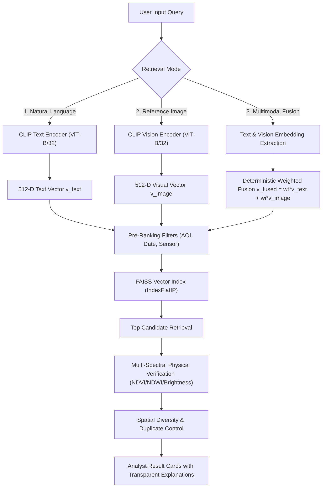

# BIRDSΣY3 — Phase 4E: Semantic & Multimodal Retrieval Intelligence Documentation

## 1. Overview
Phase 4E enhances the BIRDSΣY3 retrieval system to fulfill the SIH requirement for **Semantic and Multimodal Retrieval of Satellite Imagery**. The system supports natural-language semantic prompts, visual reference-image matching, and a combined multimodal fusion mode combining text and image modalities deterministically.

---

## 2. Retrieval Modalities & Architecture



### A. Natural-Language Text Search
- **Input**: Natural-language domain prompts (e.g., `"new construction near roads"`, `"cleared vegetation"`, `"expansion of built-up area"`, `"water body expansion"`).
- **Processing**: Prompts are transformed into 512-D embedding vectors using domain-ensembling prompts via CLIP (ViT-B/32).
- **Physical Verification**: Query intent is classified into target categories (`BUILT_UP`, `VEGETATION`, `WATER`, `BARREN`, `GENERAL`) and cross-verified against multi-spectral band ratios (NDVI, NDWI, Surface Brightness).

### B. Reference-Image Search
- **Input**: Uploaded satellite imagery patches (`.tif`, `.tiff`, `.png`, `.jpg`, `.jpeg`, `.webp`).
- **Processing**: Supports GeoTIFF reading via `rasterio.io.MemoryFile` and PIL fallback. Extracts a normalized 512-D visual embedding vector.
- **Matching**: FAISS inner product index identifies top matching satellite tiles across staged multi-temporal observations.

### C. Combined Multimodal Fusion Search
- **Input**: Text prompt $T$ AND uploaded reference satellite image patch $I$.
- **Fusion Method**: Fuses normalized text embedding $v_{\text{text}}$ and visual embedding $v_{\text{image}}$ deterministically:
  $$v_{\text{fused}} = \frac{w_t \cdot v_{\text{text}} + w_i \cdot v_{\text{image}}}{\|w_t \cdot v_{\text{text}} + w_i \cdot v_{\text{image}}\|_2}$$
  Where $w_t$ (`text_weight`) and $w_i$ (`image_weight`) are transparent configurable parameters ($w_t + w_i = 1.0$).
- **Scoring**: Computes individual similarity components $S_{\text{text}} = \langle v_{\text{text}}, v_{\text{tile}} \rangle$ and $S_{\text{image}} = \langle v_{\text{image}}, v_{\text{tile}} \rangle$, yielding raw combined similarity $S_{\text{fused}} = w_t S_{\text{text}} + w_i S_{\text{image}}$.
- **Fallbacks**: If only text is supplied, system executes text mode. If only image is supplied, system executes image mode. If neither is supplied, system returns HTTP 400 validation error.

---

## 3. Pre-Ranking Filtering Engine

Filtering is evaluated **BEFORE** expensive feature/spectral calculations:
1. **Geographic / AOI Restriction**: `aoi_bbox` `[min_lon, min_lat, max_lon, max_lat]` or `aoi_polygon` `[[lon, lat], ...]`. Filters candidates via `AOIEngine` spatial intersection catalog.
2. **Temporal / Date Range Restriction**: `start_date` and `end_date` (ISO `YYYY-MM-DD`). Candidates are filtered against tile `acquisition_datetime`.
3. **Sensor Constellation Restriction**:
   - `OPTICAL` or `ALL`: Returns staged Sentinel-2 MSI Level-2A imagery.
   - `SAR`: Honestly returns 0 results (`"available": false`, `search_id: "sar_not_cached"`, `"message": "Sentinel-1 SAR C-band data is not currently available in local storage."`). Sentinel-1 SAR imagery is never fabricated.

---

## 4. Ranking Formula & Calibrated Match Percentage

1. **Raw Vector Similarity**:
   In CLIP hypersphere, cosine noise floor is $\sim 0.16$, strong match is $\sim 0.28$, optimal is $\ge 0.34$.
   $$\text{CLIP}_{\text{norm}} = \text{clip}\left(\frac{S_{\text{raw}} - 0.16}{0.34 - 0.16}, 0.0, 1.0\right)$$
   $$\text{BaseConfidence} = 58.0 + \frac{32.0}{1.0 + e^{-6.5 \cdot (\text{CLIP}_{\text{norm}} - 0.45)}}$$

2. **Multi-Spectral Physical Verification**:
   - **Vegetation**: Boosts score up to $+12\%$ if $\text{NDVI} > 0.40$; penalizes $-30\%$ if $\text{NDVI} < 0.18$.
   - **Water**: Boosts score up to $+14\%$ if $\text{NDWI} > 0.05$; penalizes $-35\%$ if $\text{NDWI} < -0.15$.
   - **Built-Up**: Boosts score $+8\%$ if Brightness $> 1350$ & $\text{NDVI} < 0.32$; penalizes $-20\%$ if dense canopy ($\text{NDVI} > 0.45$).
   - **Barren**: Boosts score $+10\%$ if Brightness $> 1400$ & $\text{NDVI} < 0.20$.

3. **Final Calibrated Score**:
   $$\text{Match Percentage} = \text{clip}(\text{BaseConfidence} + \text{PhysicsBoost}, 12.0\%, 99.1\%)$$
   $$\text{Final Score} = \frac{\text{Match Percentage}}{100.0}$$

---

## 5. Transparent Explainability Fields

Every ranked result item returns structured, verifiable explanation fields:

```json
{
  "rank": 1,
  "tile_id": "tile_00528d6c-d9cd-4523-b4d8-9cb3eb30af96",
  "final_score": 0.885,
  "match_percentage": 88.5,
  "semantic_similarity": 0.84,
  "image_similarity": 0.91,
  "fusion_weights": { "text": 0.5, "image": 0.5 },
  "physical_score": 0.08,
  "filters": {
    "aoi": true,
    "date": true,
    "sensor": true
  },
  "explanation": [
    "Multimodal fusion match (Text weight: 0.50, Image weight: 0.50)",
    "Semantic text similarity: 0.84",
    "Reference-image similarity: 0.91",
    "Inside requested AOI spatial bounds",
    "Acquisition date (2024-02-23) matches requested period",
    "Sensor match: Sentinel-2 MSI Level-2A",
    "Physical gating: Impervious Reflectance (Brightness: 1450)"
  ],
  "acquisition_date": "2024-02-23",
  "sensor": "Sentinel-2 MSI Level-2A",
  "wgs_bbox": [88.305, 22.512, 88.325, 22.532],
  "spectral_indices": { "ndvi": 0.21, "ndwi": -0.12, "brightness": 1450.0 }
}
```

---

## 6. Spatial Diversity & Duplicate Control

To avoid flooding top-k results with spatial duplicate tiles covering identical geographic extent and date, `apply_diversity_filter` deduplicates candidates based on:
$$\text{SpatialKey} = (\text{round}(\text{wgs\_bbox}, 4), \text{acquisition\_date})$$
When `diversity_control: true` (default), only the highest-scoring candidate per spatial extent key is returned, ensuring diverse top-k coverage.

---

## 7. Real API Endpoints

- `POST /api/search/semantic`: Natural-language text search with AOI, date range, and sensor filters.
- `POST /api/search/image/upload`: Reference-image upload search supporting GeoTIFF, PNG, JPEG.
- `POST /api/search/multimodal`: Combined multimodal fusion search (accepts JSON or multipart Form with image upload).

---

## 8. Offline & On-Premise Operation

- **Vector Model**: Local PyTorch / CLIP ViT-B/32 model execution.
- **Index**: Local FAISS `IndexFlatIP` on disk (`data/index/faiss_index.bin`).
- **Database**: Local MongoDB instance (`birdsey3.searches`, `birdsey3.tiles`, `birdsey3.provenance`).
- **Zero Third-Party Cloud Dependencies**: No external API keys required.
